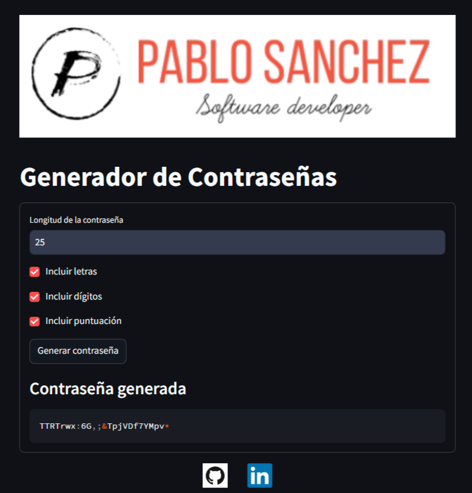

# Generador de Contraseñas Seguras

- Este repositorio contiene scripts en Python para generar contraseñas seguras utilizando diferentes interfaces. 
- Se incluyen implementaciones básicas, así como interfaces gráficas y de línea de comandos. 

   

## Probar en Línea

Puedes probar este script directamente en tu navegador sin necesidad de instalar nada.

- [Ejecutación rápida de Secure Pass Generator en Streamlit Cloud](https://secure-pass-generator.streamlit.app/)

## Archivos y Descripción

### 1. secure_pass_generator.py

Este archivo contiene la lógica principal para generar contraseñas seguras. Utiliza el módulo `secrets` de Python para garantizar la aleatoriedad y seguridad de las contraseñas generadas.

#### Uso
```bash
python secure_pass_generator.py
```
El programa solicitará:
- Longitud de la contraseña
- Inclusión de letras (sí/no)
- Inclusión de dígitos (sí/no)
- Inclusión de puntuación (sí/no)

Generará una contraseña basada en las preferencias del usuario.

### 2. streamlit_secure_pass_generator.py

- Este archivo proporciona una interfaz de usuario interactiva para generar contraseñas utilizando la biblioteca `Streamlit`. 
- Es ideal para su uso en un entorno web o como una herramienta de demostración.

#### Uso
```bash
streamlit run streamlit_secure_pass_generator.py
```
- Acceda a la interfaz web generada y configure las opciones para generar la contraseña deseada.

### 3. test_secure_pass_generator.py

Incluye pruebas unitarias para la función de generación de contraseñas, garantizando que la lógica funcione correctamente bajo diferentes condiciones.

#### Uso
```bash
pytest test_secure_pass_generator.py
```
- Ejecuta las pruebas para verificar que el generador de contraseñas funcione correctamente.

### 4. tkinter_secure_pass_generator.py

- Este archivo proporciona una interfaz gráfica de usuario utilizando `Tkinter`. 
- Permite a los usuarios generar contraseñas seguras a través de una ventana de aplicación de escritorio.

#### Uso
```bash
python tkinter_secure_pass_generator.py
```
Abre una ventana de GUI donde se pueden configurar las opciones de generación de contraseñas y copiar la contraseña generada al portapapeles.

## Requisitos

- Python 3.x
- Streamlit 
- Tkinter 
- pytest 

## Instalación

1. Clonar el repositorio.
2. Instalar las dependencias necesarias:
   ```bash
   pip install -r requirements.txt
   ```

## Contribuciones

¡Las contribuciones son bienvenidas! Por favor, haga un fork del repositorio y envíe un pull request con sus mejoras.
