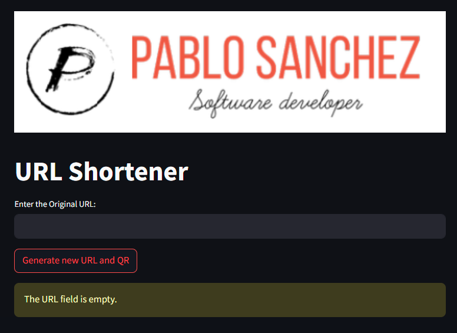

# URL Shortener + QR
- URL Shortener es una aplicación web sencilla creada con Streamlit que permite acortar URLs utilizando el servicio TinyURL. 
- Esta aplicación es útil para convertir URLs largas en enlaces más cortos, fáciles de compartir.


## Requisitos
- Python 3.x
- Bibliotecas de Python:
    - `pyshorteners`
      - [Pyshorteners documentation](https://pyshorteners.readthedocs.io/en/latest/)
    - `streamlit`
      - [Streamlit documentation](https://streamlit.io/)
    - `qrcode`
       - [Qrcode documentation](https://pypi.org/project/qrcode/)
    - `validators`
       - [validators documentation](https://validators.readthedocs.io/en/latest/)
    - `requests`
       - [Requests documentation](https://requests.readthedocs.io/en/latest/)

## Instalación
1. Clona el repositorio o descarga el código fuente.
2. Instala las dependencias necesarias utilizando pip:
   
    ```bash
    pip install pyshorteners streamlit qrcode validators requests
    ```

3. Comprueba que los recursos gráficos estén en ./resources:
    - `favicon.ico`: El ícono de la página (favicon).
    - `logohorizontal.png`: El logo que se muestra en la parte superior de la aplicación.
  
## Uso
Para ejecutar la aplicación, utiliza el siguiente comando:
```bash
streamlit run path_to_your_script.py
```
- Reemplaza `path_to_your_script.py` con la ruta al archivo del script.

## Funcionalidades
- **Acortar URLs**
    - Ingresa la URL que deseas acortar en el campo de texto y presiona el botón "Generate new URL and QR".
La URL acortada aparecerá debajo del botón.
- **Generar Código QR**
    - Después de acortar la URL, se generará un código QR que se mostrará debajo de la URL acortada.
- **Validación de URLs**
    - La aplicación verifica si la URL ingresada es válida y accesible antes de acortarla y generar el código QR.

    
  
## Estructura del Proyecto
```
.
├── resources
│   ├── favicon.ico
│   └── logohorizontal.png
└── url_shortener.py
```

## Contribuciones
Las contribuciones son bienvenidas. Puedes forkear el proyecto, hacer tus mejoras y enviar un pull request.
